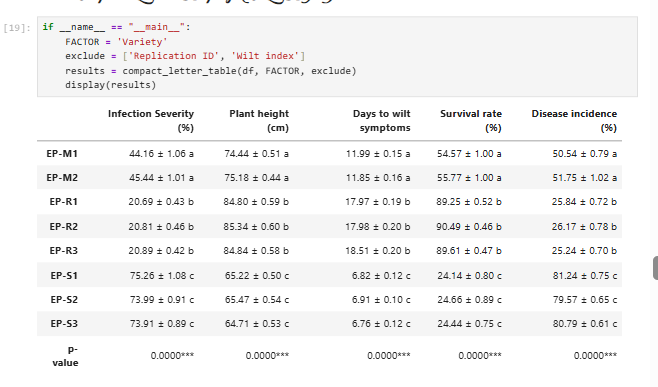

<h1 align='center'> Compact Letter Display (CLD) for Tukey HSD Results</h1>

## 📃 Overview

In statistical analysis, particularly in agricultural, biological, and social sciences research, comparing group means is essential for understanding treatment effects. **Tukey’s Honest Significant Difference (HSD)** test is widely used for post-hoc comparisons after ANOVA. However, interpreting results can be challenging when multiple groups are involved.

This project implements a **Compact Letter Display (CLD)** system in Python to **simplify Tukey HSD results** by assigning letters to groups. Groups that share the same letter are **not significantly different**, while groups with different letters are significantly distinct. This approach provides a **clear, concise, and publication-ready interpretation** of Tukey’s HSD output.

---

## ⚙️ Workflow / Methodology

1. **Data Preparation**

   * Load dataset into a Pandas DataFrame.
   * Identify the dependent variable and grouping factor.

2. **Perform ANOVA**

   * Conduct one-way ANOVA to determine if significant differences exist.

3. **Run Tukey’s HSD Test**

   * Apply `statsmodels` Tukey HSD procedure to compute pairwise group comparisons.

4. **Generate Compact Letter Display (CLD)**

   * Process Tukey HSD results.
   * Assign letters to each group based on significance.

5. **Output Results**

   * Generate a clean summary table with means, standard errors, and assigned letters.
   * Provide easy-to-interpret visualizations (optional).

---

## 🛠️ Technology Used

* **Python** (Core programming language)
* **Pandas** → Data manipulation and handling
* **NumPy** → Numerical computations
* **SciPy** → ANOVA and statistical testing
* **Statsmodels** → Tukey HSD implementation
* **Matplotlib / Seaborn** → Visualization of results (barplots with letters)

---

## 📈 Results

* Groups are displayed alongside their **means, standard errors, and CLD letters**.
* Compact letters make it **easy to interpret which groups differ** without scanning through large pairwise comparison tables.
* Visual representation provides a **clearer understanding of treatment effects** for reports, academic papers, or presentations.

Compact Letter Display (CLD) Table:



*(Groups sharing the same letter are not significantly different.)*

---

## 🌍 Applications

* **Agricultural Research** → Comparing crop yields under different treatments.
* **Biological Experiments** → Analyzing gene expression, drug effects, or ecological differences.
* **Social Sciences** → Simplifying survey or behavioral study results.
* **Publication & Reporting** → Generating **publication-ready outputs** with minimal manual editing.

---

## 🚀 Usage

1. Clone this repository:

   ```bash
   git clone https://github.com/yourusername/compact-letter-display-tukey.git
   cd compact-letter-display-tukey
   ```

2. Install dependencies:

   ```bash
   pip install -r requirements.txt
   ```

3. Run the example script:

   ```bash
   python main.py
   ```

4. Replace the dataset with your own experimental data.

---

## 🤝 Contribution

Contributions are welcome! If you’d like to improve the workflow, add new visualization options, or extend the project to other post-hoc tests, feel free to fork the repo and submit a pull request.

---

## 📌 License

This project is licensed under the MIT License.
